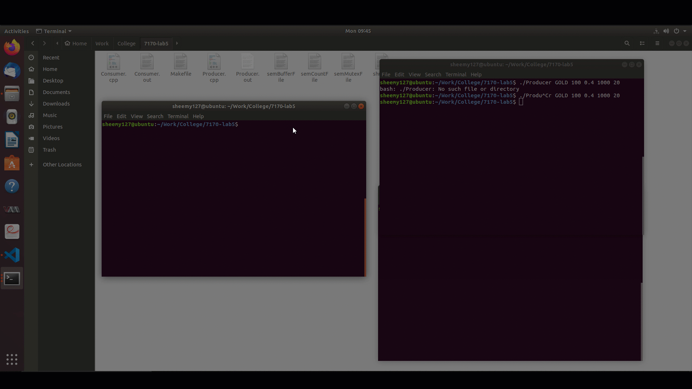

# Commodities real-time price chart simulator
C++ application that displays a live price chart for 20 Commodities. The chart is updated in real time according to the price changes. The application is an implementation of the producer and consumer problem in Operating Systems which utilizes the concepts of Shared memory, Syncronization and inter-process communication.

The updated price chart is considered to be a Consumer process that fetches the price updates from the Producer processes through the shared memory buffer. The Producer processes updates the price iteratively.

I used semaphores from <sys/sem> to handle synchronization, I used shared memory buffers from <sys/shm.h> and i utilized inter-process communication from <sys/ipc.h>

## Installation & Usage

> **Note:** Make sure you run the application on a UNIX environment since SystemV Unix library is used in the application.

1. Clone the github repo
2. Type ```make clean```
3. Type ```make build```
4. Run Consumer process first ```./Consumer.out```
5. Run a Producer process (ex. LEAD price update) ```./Producer.out LEAD 100 0.5 1000 20``` 
    **The producer process takes 5 parameters the first parameter is the Commodity Name, the second parameter is the starting price, the third parameter is the standard deviation to generate random prices, the fourth parameter is the sleep time between each price update and the final parameter is the size of the buffer.**

6. Now you can see the consumer process updates the price chart


Demo view:



## File Structure
1. **Consumer.cpp**: holds the the code for handling the consumer process
2. **Producer.cpp**: holds the code for handling the producer process
3. **Makefile**: Make file for building the project